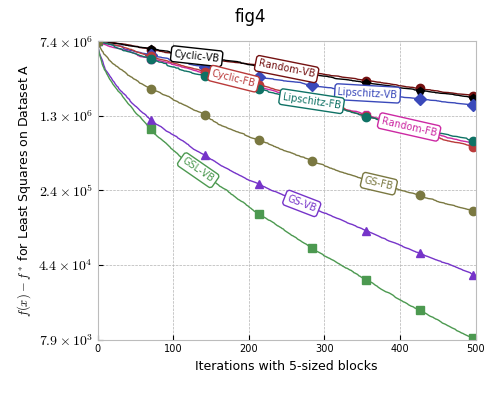
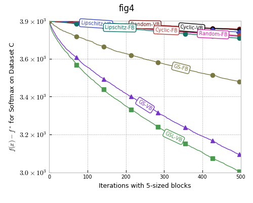
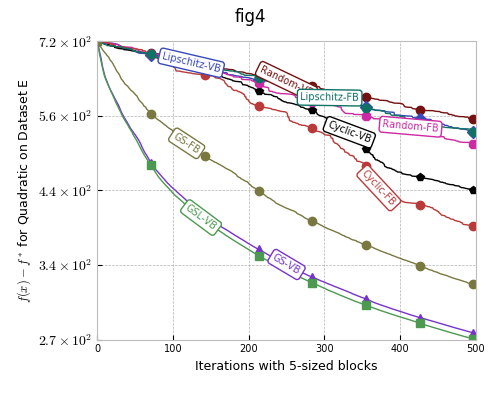
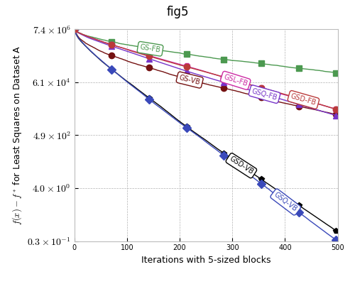
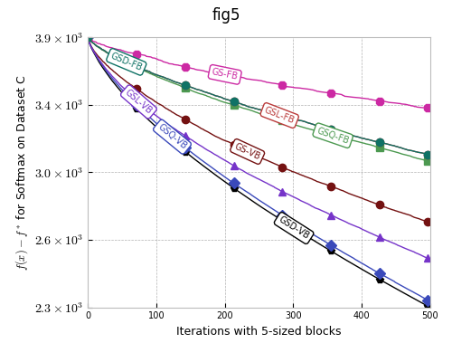
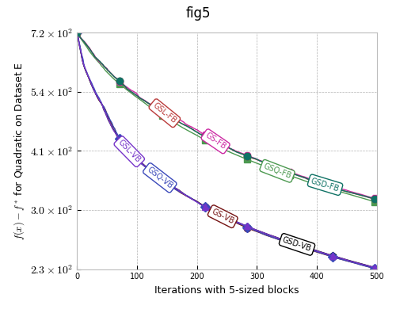
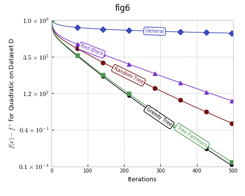
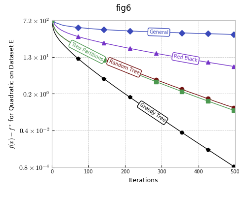
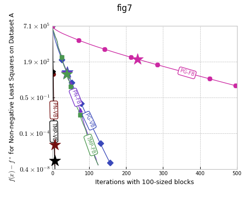

# Let’s Make Block Coordinate Descent Go Fast

## [Link to the arXiv paper](https://arxiv.org/pdf/1712.08859.pdf)


Reproducing the experiments in the paper
========================================

### You can run the experiments as follows.

1. Open Terminal (or Command Prompt in Windows);

2. Download this repository by running the command,
```
git clone https://github.com/IssamLaradji/BlockCoordinateDescent.git
```

3. Go into the code's directory,
```
cd BlockCoordinateDescent
```

4. Run the command for a figure number as shown in the sections below.


Figure 4
--------
* This experiment compares between different random and greedy block selection rules on three different problems using gradient updates (or the **Lb** update rule).

* To run the experiment and generate the plots, type the following in Terminal,

```python
python main.py -e fig4
```


|         |            |   |
| ------------- |:-------------:| -----:|
|      |  |  |

Figure 5
--------
* This experiment compares between different greedy block selection rules on three different problems when using matrix updates (or the **Hb** update rule).

* To run the experiment and generate the plots, type the following in Terminal,


```python
python main.py -e fig5
```


|         |            |   |
| ------------- |:-------------:| -----:|
|      |  |  |

Figure 6
--------
* This experiment compares between different greedy block selection rules on two quadratic graph-structured problems when using optimal updates.

* To run the experiment and generate the plots, type the following in Terminal,
```python
python main.py -e fig6
```


|         |            |   |
| ------------- |:-------------:| -----:|
|      |  |  |

Figure 7
--------
* This experiment compares between different updates when using greedy fixed and variable blocks of different siz

* To run the experiment and generate the plots, type the following in Terminal,

```python
python main.py -e fig7
```


|         |            |   |
| ------------- |:-------------:| -----:|
|      |  |  |
