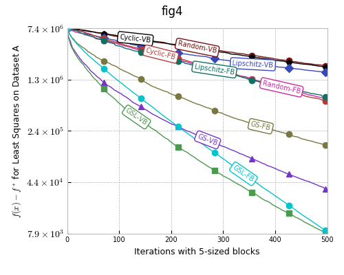
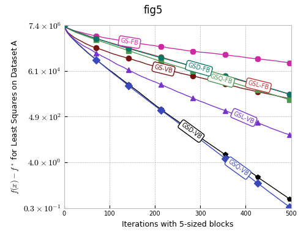
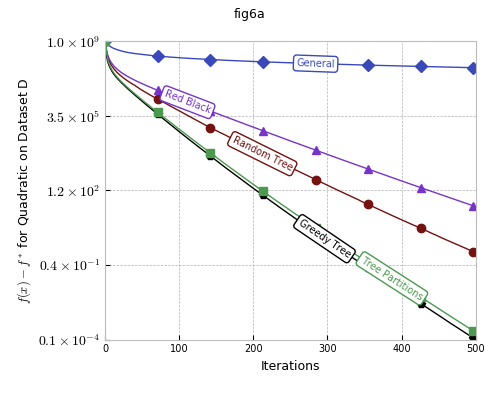
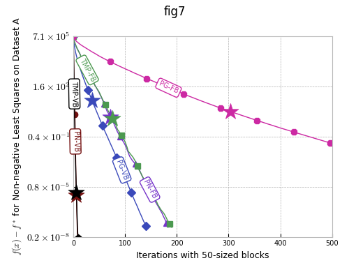
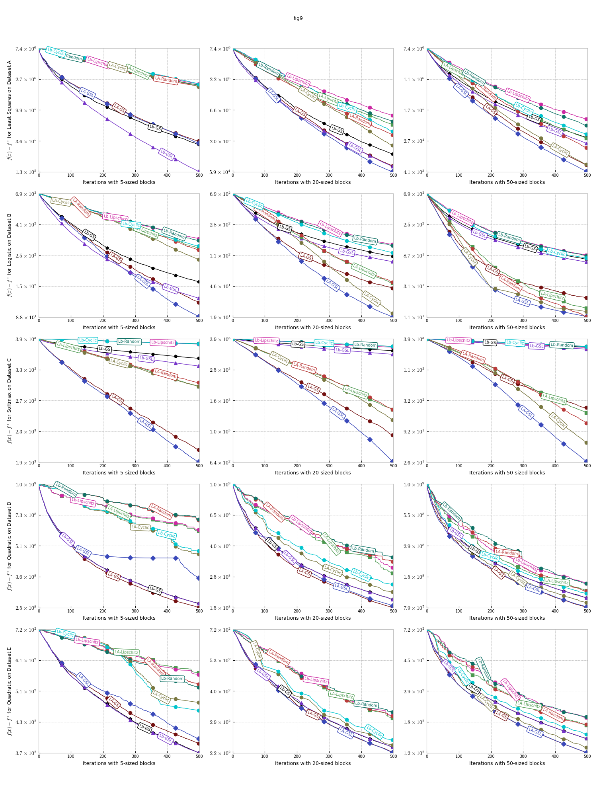
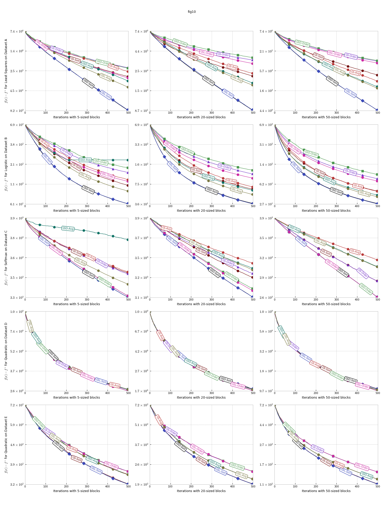

[](https://opensource.org/licenses/Apache-2.0)

<h1 align="center">BCD: Let’s Make Block Coordinate Descent Go Fast</h1>
<h5 align="center">It uses an attention mechanism to learn from the most confident regions in order to infer predictions in the less confident ones.</h5>

[[Paper]](https://arxiv.org/pdf/1712.08859.pdf)  [](https://twitter.com/intent/tweet?text=Check%20out%20LooC!%20%E2%9C%A8%20An%20Localize,%20Overlapping%20Objects%20with%20count%20any%20Supervision%20E2%9C%A8%20https://github.com/ElementAI/looc%20%F0%9F%A4%97) [Share on Facebook]

Image here

## Table of Contents

- [What the research is](#what-the-research-is)
- [How it works](#how-it-works)
- [Why it matters](#why-it-matters)
- [Experiments](#experiments)

## What the research is

Image 2 here

## How it works

Image 3 here

## Why it matters

Image 4 here

## Experiments

Image 5 here

Reproducing the experiments (Figures 4-13) in the paper
-------------------------------------------------------

### You can run the experiments as follows.

1. Open Terminal (or Command Prompt in Windows);

2. Download this repository by running the command,
```
git clone https://github.com/IssamLaradji/BlockCoordinateDescent.git
```

3. Go into the code's directory,
```
cd BlockCoordinateDescent
```

4. Run the command for a figure number as shown in the sections below.

Below we show how to generate each of the 4-13 Figures in the paper.

###  Figure 4


```python
python main.py -e fig4
```


|         |            |   |
| ------------- |:-------------:| -----:|
|      |  |  |

### Figure 5


```python
python main.py -e fig5
```


|         |            |   |
| ------------- |:-------------:| -----:|
|      |  |  |

### Figure 6


```python
python main.py -e fig6a fig6b
```


|         |            |   |
| ------------- |:-------------:| -----:|
|      |  

### Figure 7


```python
python main.py -e fig7
```


|         |            |   |
| ------------- |:-------------:| -----:|
|      |  |  |


### Figure 8


```python
python main.py -e fig8
```


|         |            |   |
| ------------- |:-------------:| -----:|
| 


### Figure 9


```python
python main.py -e fig9
```


|         |            |   |
| ------------- |:-------------:| -----:|
| 


### Figure 10


```python
python main.py -e fig10
```


|         |            |   |
| ------------- |:-------------:| -----:|
| 

### Figure 11


```python
python main.py -e fig11
```


|         |            |   |
| ------------- |:-------------:| -----:|
| 


### Figure 12


```python
python main.py -e fig12
```


|         |            |   |
| ------------- |:-------------:| -----:|
| 

### Figure 13


```python
python main.py -e fig13
```


|         |            |   |
| ------------- |:-------------:| -----:|
| 


## Citation 
If you find the code useful for your research, please cite:

```bibtex
@Article{nutini2017let,
  title={Let's Make Block Coordinate Descent Go Fast: Faster Greedy Rules, Message-Passing, Active-Set Complexity, and Superlinear Convergence},
  author={Nutini, Julie and Laradji, Issam and Schmidt, Mark},
  journal={arXiv},
  year={2017}
}
```
